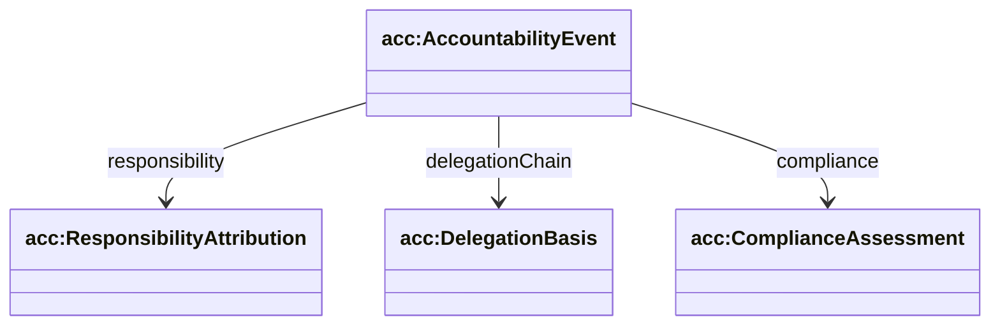
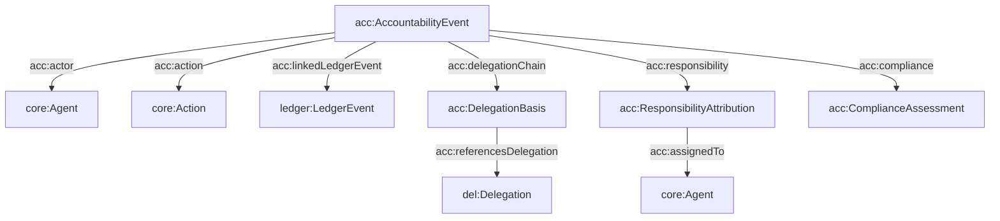

## Accountability Ontology (`ontologies/accountability.ttl`)

Defines how to assess **correctness, authorization, and compliance** for executed actions. Binds together actor, action, delegation basis, responsibility attribution, compliance assessment, and ledger evidence.

### Key terms

- **Classes**
  - `acc:AccountabilityEvent`
  - `acc:ResponsibilityAttribution`
  - `acc:DelegationBasis`
  - `acc:ComplianceAssessment`
- **Datatype properties**
  - `acc:eventId`, `acc:timestamp`
  - `acc:intent` (string)
  - `acc:rationale`
  - `acc:aiActSection`, `acc:riskClass`
- **Object properties**
  - `acc:actor` → `core:Agent`
  - `acc:action` → `core:Action`
  - `acc:delegationChain` → `acc:DelegationBasis`
  - `acc:referencesDelegation` → `del:Delegation`
  - `acc:responsibility` → `acc:ResponsibilityAttribution`
  - `acc:assignedTo` → `core:Agent`
  - `acc:compliance` → `acc:ComplianceAssessment`
  - `acc:linkedLedgerEvent` → `ledger:LedgerEvent`

### Hierarchy diagram



### Relationship diagram



### SPARQL queries

```sparql
PREFIX acc: <https://w3id.org/agent-ontology/accountability#>
PREFIX ledger: <https://w3id.org/agent-ontology/ledger#>

# 1) Accountability events with linked ledger evidence
SELECT ?ae ?ledgerEvent WHERE {
  ?ae a acc:AccountabilityEvent .
  OPTIONAL { ?ae acc:linkedLedgerEvent ?ledgerEvent . }
}
```

```sparql
PREFIX acc: <https://w3id.org/agent-ontology/accountability#>

# 2) Find events missing compliance assessment
SELECT ?ae WHERE {
  ?ae a acc:AccountabilityEvent .
  FILTER NOT EXISTS { ?ae acc:compliance ?c . }
}
```

### Example (Agent Trust Graph domain)

```turtle
@prefix acc: <https://w3id.org/agent-ontology/accountability#> .
@prefix ledger: <https://w3id.org/agent-ontology/ledger#> .
@prefix del: <https://w3id.org/agent-ontology/delegation#> .
@prefix agent: <https://w3id.org/agent-ontology/agent#> .
@prefix core: <https://w3id.org/agent-ontology/core#> .
@prefix gc: <https://global.church/ontology/gc#> .
@prefix xsd: <http://www.w3.org/2001/XMLSchema#> .

gc:acct-event-0001 a acc:AccountabilityEvent ;
  acc:eventId "acct_0001" ;
  acc:timestamp "2026-06-15T12:00:03Z"^^xsd:dateTime ;
  acc:actor gc:ncf-gca-eth ;
  acc:action gc:action-disburse-grant-001 ;
  acc:linkedLedgerEvent gc:ledger-event-0001 ;
  acc:delegationChain [
    a acc:DelegationBasis ;
    acc:referencesDelegation gc:delegation-2026-06
  ] ;
  acc:responsibility [
    a acc:ResponsibilityAttribution ;
    acc:assignedTo gc:ncf-gca-eth ;
    acc:rationale "Delegation scope valid; payer policy satisfied; signed ledger proof present."
  ] ;
  acc:compliance [
    a acc:ComplianceAssessment ;
    acc:aiActSection "N/A (organizational funding workflow)" ;
    acc:riskClass "low"
  ] .

gc:ncf-gca-eth a agent:Organization .
gc:action-disburse-grant-001 a core:Action .
gc:ledger-event-0001 a ledger:RuntimeLedgerEvent .
gc:delegation-2026-06 a del:Delegation .
```

