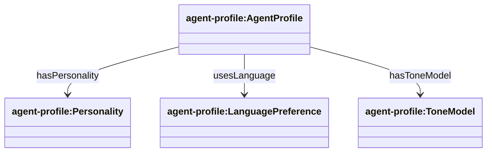
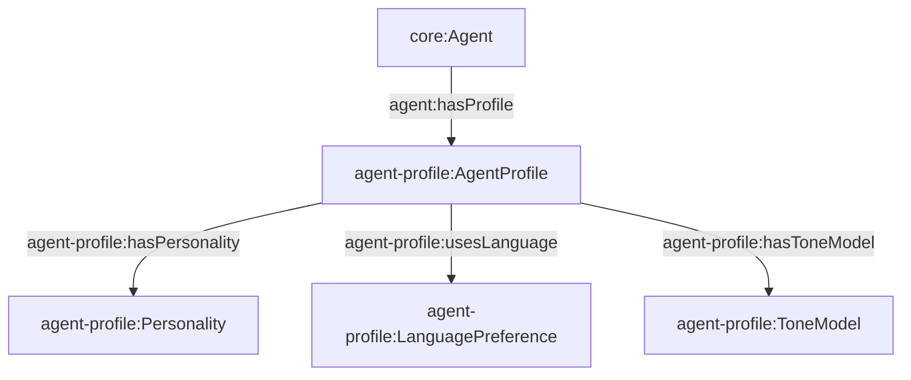

## Agent Profile Ontology (`ontologies/agent-profile.ttl`)

Defines the “pragmatic layer” of agent behavior: personality-like preferences, language preferences, and tone models. This does not define *what an agent can do* (capability), but *how it tends to behave* while doing it.

### Key terms

- **Classes**
  - `agent-profile:AgentProfile`
  - `agent-profile:Personality`
  - `agent-profile:LanguagePreference`
  - `agent-profile:ToneModel`
- **Object properties**
  - `agent-profile:hasPersonality` (Profile → Personality)
  - `agent-profile:usesLanguage` (Profile → LanguagePreference)
  - `agent-profile:hasToneModel` (Profile → ToneModel)

### Hierarchy diagram



### Relationship diagram



### SPARQL queries

```sparql
PREFIX agent: <https://w3id.org/agent-ontology/agent#>
PREFIX ap: <https://w3id.org/agent-ontology/agent-profile#>

# 1) Agents with their profiles
SELECT ?agent ?profile WHERE {
  ?agent agent:hasProfile ?profile .
}
```

```sparql
PREFIX ap: <https://w3id.org/agent-ontology/agent-profile#>

# 2) Profiles and their components
SELECT ?profile ?personality ?language ?tone WHERE {
  ?profile a ap:AgentProfile .
  OPTIONAL { ?profile ap:hasPersonality ?personality . }
  OPTIONAL { ?profile ap:usesLanguage ?language . }
  OPTIONAL { ?profile ap:hasToneModel ?tone . }
}
```

### Example (Agent Trust Graph domain)

```turtle
@prefix agent: <https://w3id.org/agent-ontology/agent#> .
@prefix ap: <https://w3id.org/agent-ontology/agent-profile#> .
@prefix gc: <https://global.church/ontology/gc#> .

gc:ecfa-gca-eth a agent:Organization ;
  agent:hasProfile ap:DefaultProfile .
```

