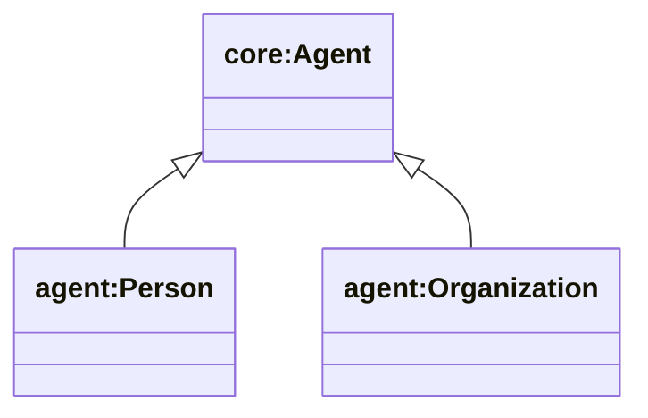
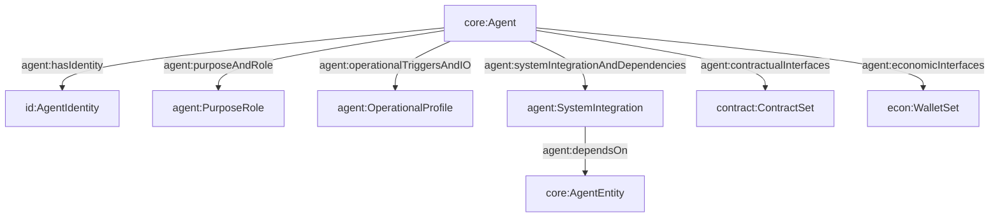

## Agent Ontology (`ontologies/agent.ttl`)

Adds “AI Agent as an entity in the world” structure on top of `core:Agent`: identity binding, purpose/role, operational IO, system integration dependencies, lifecycle, economics, and contractual interfaces. Also introduces `agent:Person` and `agent:Organization` as common agent specializations.

### Key terms

- **Classes**
  - `agent:PurposeRole`, `agent:OperationalProfile`, `agent:Trigger`, `agent:InputSpec`, `agent:OutputSpec`
  - `agent:SystemIntegration`, `agent:InterfaceSpec`
  - `agent:IdentitySet`, `agent:IdentityBinding`
  - `agent:Person` (`rdfs:subClassOf core:Agent`)
  - `agent:Organization` (`rdfs:subClassOf core:Agent`)
- **Object properties (domain `core:Agent` unless noted)**
  - `agent:hasProfile` → `agent-profile:AgentProfile`
  - `agent:hasIdentity` → `id:AgentIdentity`
  - `agent:purposeAndRole` → `agent:PurposeRole`
  - `agent:operationalTriggersAndIO` → `agent:OperationalProfile`
  - `agent:systemIntegrationAndDependencies` → `agent:SystemIntegration`
  - `agent:economicInterfaces` → `econ:WalletSet`
  - `agent:identityInterfaces` → `agent:IdentitySet`
  - `agent:lifecycleManagement` → `life:LifecycleRecord`
  - `agent:contractualInterfaces` → `contract:ContractSet`
  - `agent:dependsOn` (domain `agent:SystemIntegration`) → `core:AgentEntity`
- **Datatype properties**
  - `agent:objective`, `agent:owner` (on `agent:PurposeRole`)
  - `agent:keyManagementSystem` (on `agent:IdentityBinding`)

### Hierarchy diagram



### Relationship diagram



### SPARQL queries

```sparql
PREFIX core: <https://w3id.org/agent-ontology/core#>
PREFIX agent: <https://w3id.org/agent-ontology/agent#>

# 1) Organizations and their stated objectives/owners
SELECT ?org ?objective ?owner WHERE {
  ?org a agent:Organization ;
       agent:purposeAndRole ?pr .
  OPTIONAL { ?pr agent:objective ?objective . }
  OPTIONAL { ?pr agent:owner ?owner . }
}
```

```sparql
PREFIX agent: <https://w3id.org/agent-ontology/agent#>

# 2) System dependencies between agents/components
SELECT ?agent ?dependsOn WHERE {
  ?agent agent:systemIntegrationAndDependencies ?si .
  ?si agent:dependsOn ?dependsOn .
}
```

### Example (Agent Trust Graph domain)

```turtle
@prefix core: <https://w3id.org/agent-ontology/core#> .
@prefix agent: <https://w3id.org/agent-ontology/agent#> .
@prefix id: <https://w3id.org/agent-ontology/identity#> .
@prefix gc: <https://global.church/ontology/gc#> .
@prefix rdfs: <http://www.w3.org/2000/01/rdf-schema#> .

# A Global.Church org agent anchored by an ENS name (modeled as a domain identifier)
gc:grace-community-gca-eth a agent:Organization ;
  rdfs:label "Grace Community Church" ;
  agent:purposeAndRole [
    a agent:PurposeRole ;
    agent:objective "Fund scripture translation for the Shaikh people group" ;
    agent:owner "Grace Community Church board"
  ] ;
  agent:hasIdentity [
    a id:AgentIdentity ;
    id:title "grace-community.gca.eth"
  ] ;
  gc:hasOrganizationType gc:Church .
```

