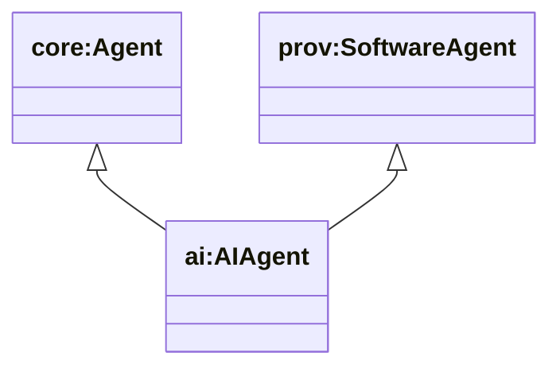
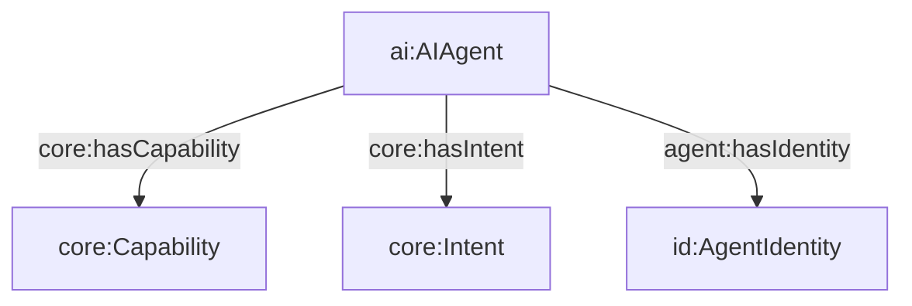

## AI Agent Ontology (`ontologies/ai-agent.ttl`)

Defines `ai:AIAgent` as a **software agent** (PROV-O) that also instantiates the repo’s `core:Agent` semantics. This gives a clean place to say “this is an agent, and it is software” without forcing `core:Agent` (which also covers `agent:Person` / `agent:Organization`) to be software-only.

### Key terms

- **Class**
  - `ai:AIAgent`
- **Key superclass alignments**
  - `core:Agent`
  - `prov:SoftwareAgent`

### Hierarchy diagram



### Relationship diagram (where it sits)



### SPARQL queries

```sparql
PREFIX ai: <https://w3id.org/agent-ontology/ai-agent#>
PREFIX prov: <http://www.w3.org/ns/prov#>

# 1) Show AI agents that are prov:SoftwareAgent
SELECT ?x WHERE {
  ?x a ai:AIAgent .
  ?x a prov:SoftwareAgent .
}
```

```sparql
PREFIX ai: <https://w3id.org/agent-ontology/ai-agent#>
PREFIX core: <https://w3id.org/agent-ontology/core#>

# 2) AI agents and their capabilities
SELECT ?agent ?cap WHERE {
  ?agent a ai:AIAgent ;
         core:hasCapability ?cap .
}
```

### Example (Agent Trust Graph domain)

```turtle
@prefix ai: <https://w3id.org/agent-ontology/ai-agent#> .
@prefix core: <https://w3id.org/agent-ontology/core#> .
@prefix agent: <https://w3id.org/agent-ontology/agent#> .
@prefix id: <https://w3id.org/agent-ontology/identity#> .
@prefix gc: <https://global.church/ontology/gc#> .
@prefix rdfs: <http://www.w3.org/2000/01/rdf-schema#> .

# An automated evaluator agent used by an accreditation body (e.g., ECFA-like)
gc:ecfa-policy-evaluator a ai:AIAgent ;
  rdfs:label "ECFA Policy Evaluator" ;
  agent:hasIdentity [
    a id:AgentIdentity ;
    id:title "ecfa-policy-evaluator.gca.eth"
  ] ;
  core:hasCapability gc:evaluateGovernanceStandards .

gc:evaluateGovernanceStandards a core:Capability ;
  rdfs:label "Evaluate governance standards" .
```

