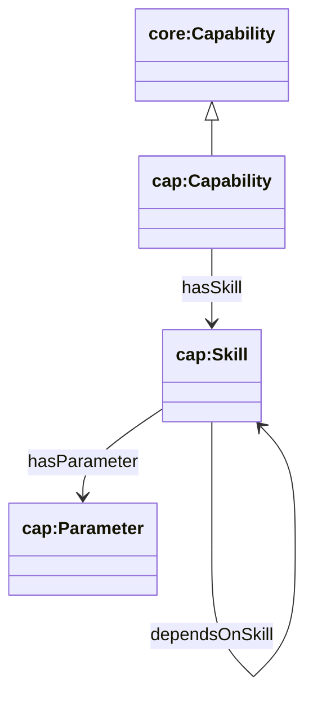
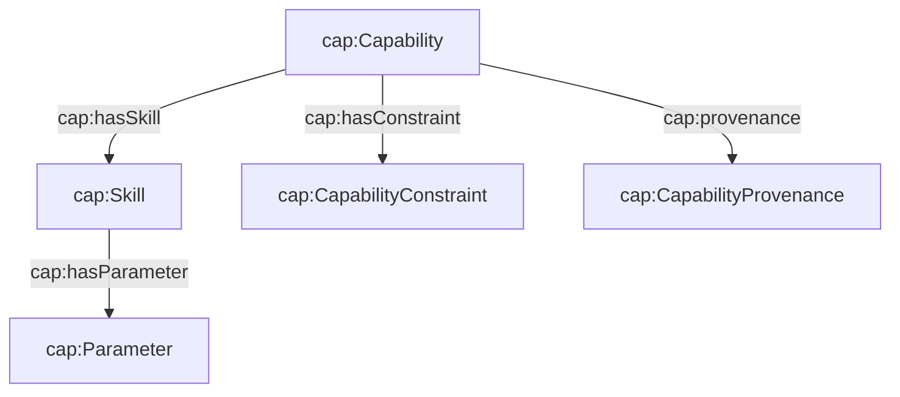

## Capability Ontology (`ontologies/capability.ttl`)

Defines how to describe what an agent can do. Separates:

- **Capability**: human/LLM-facing semantic competence (good for discovery/matching)
- **Skill**: atomic executable operation(s) implementing a capability
- **Parameter**: structured inputs for a skill

### Key terms

- **Classes**
  - `cap:Capability` (`rdfs:subClassOf core:Capability`)
  - `cap:Skill`, `cap:Parameter`
  - `cap:CapabilityConstraint`, `cap:CapabilityProvenance`
- **Object properties**
  - `cap:hasSkill` (Capability → Skill)
  - `cap:hasParameter` (Skill → Parameter)
  - `cap:dependsOnSkill` (Skill → Skill)
  - `cap:hasConstraint` (Capability → CapabilityConstraint)
  - `cap:provenance` (Capability → CapabilityProvenance)
- **Datatype properties**
  - `cap:capabilityExpression`, `cap:capabilityConfidence`
  - `cap:skillId`, `cap:description`
  - `cap:parameterName`, `cap:parameterType`
  - `cap:allowedContext`, `cap:prohibitedContext`, `cap:requiresPermission`
  - `cap:sourceSpec`, `cap:capabilityVersion`

### Hierarchy diagram



### Relationship diagram



### SPARQL queries

```sparql
PREFIX core: <https://w3id.org/agent-ontology/core#>
PREFIX cap: <https://w3id.org/agent-ontology/capability#>

# 1) Find agents that can do something like "scripture translation"
SELECT ?agent ?capability ?expr ?confidence WHERE {
  ?agent a core:Agent ; core:hasCapability ?capability .
  OPTIONAL { ?capability cap:capabilityExpression ?expr . }
  OPTIONAL { ?capability cap:capabilityConfidence ?confidence . }
  FILTER (CONTAINS(LCASE(STR(?expr)), "scripture") || CONTAINS(LCASE(STR(?expr)), "translation"))
}
```

```sparql
PREFIX cap: <https://w3id.org/agent-ontology/capability#>

# 2) Expand capability → skills → parameters
SELECT ?capability ?skill ?paramName ?paramType WHERE {
  ?capability cap:hasSkill ?skill .
  OPTIONAL {
    ?skill cap:hasParameter ?p .
    OPTIONAL { ?p cap:parameterName ?paramName . }
    OPTIONAL { ?p cap:parameterType ?paramType . }
  }
}
```

### Example (Agent Trust Graph domain)

```turtle
@prefix core: <https://w3id.org/agent-ontology/core#> .
@prefix cap: <https://w3id.org/agent-ontology/capability#> .
@prefix gc: <https://global.church/ontology/gc#> .
@prefix rdfs: <http://www.w3.org/2000/01/rdf-schema#> .

gc:wycliffe-gca-eth a core:Agent ;
  rdfs:label "Wycliffe Bible Translators" ;
  core:hasCapability gc:scriptureTranslation .

gc:scriptureTranslation a cap:Capability ;
  rdfs:label "Scripture Translation" ;
  cap:capabilityExpression "scripture translation, language analysis, orthography development, publishing" ;
  cap:capabilityConfidence 0.92 ;
  cap:hasSkill gc:collectLanguageData, gc:produceDraftTranslation .

gc:collectLanguageData a cap:Skill ;
  cap:skillId "collect_language_data" ;
  cap:description "Collect and structure linguistic data needed to begin translation." ;
  cap:hasParameter [
    a cap:Parameter ;
    cap:parameterName "iso639_3" ;
    cap:parameterType "string"
  ] .
```

