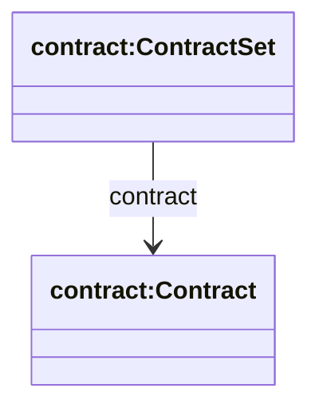
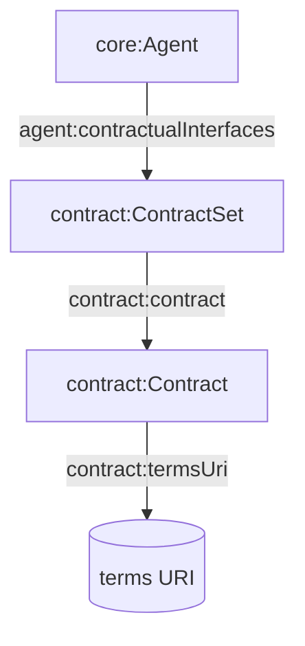

## Contract Ontology (`ontologies/contract.ttl`)

Defines a minimal structure for contractual interfaces: a set of contracts and a link to the terms URI for each contract.

### Key terms

- **Classes**
  - `contract:ContractSet`
  - `contract:Contract`
- **Object properties**
  - `contract:contract` (ContractSet → Contract)
- **Datatype properties**
  - `contract:termsUri` (Contract → URI of terms)

### Hierarchy diagram



### Relationship diagram



### SPARQL queries

```sparql
PREFIX agent: <https://w3id.org/agent-ontology/agent#>
PREFIX contract: <https://w3id.org/agent-ontology/contract#>

# 1) Agents with contract terms
SELECT ?agent ?terms WHERE {
  ?agent agent:contractualInterfaces ?set .
  ?set contract:contract ?c .
  OPTIONAL { ?c contract:termsUri ?terms . }
}
```

```sparql
PREFIX contract: <https://w3id.org/agent-ontology/contract#>

# 2) Contracts missing terms URIs
SELECT ?c WHERE {
  ?c a contract:Contract .
  FILTER NOT EXISTS { ?c contract:termsUri ?u . }
}
```

### Example (Agent Trust Graph domain)

```turtle
@prefix agent: <https://w3id.org/agent-ontology/agent#> .
@prefix contract: <https://w3id.org/agent-ontology/contract#> .
@prefix gc: <https://global.church/ontology/gc#> .

gc:gca-dao-treasury a agent:Organization ;
  agent:contractualInterfaces [
    a contract:ContractSet ;
    contract:contract [
      a contract:Contract ;
      contract:termsUri <https://global.church/terms/gca-dao-grants-v1>
    ]
  ] .
```

