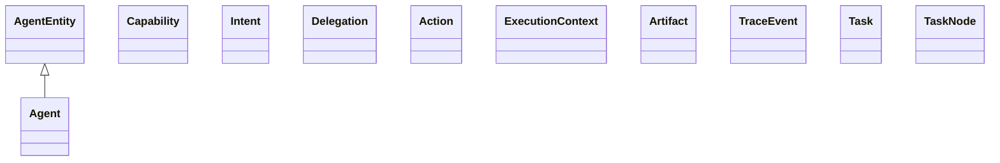
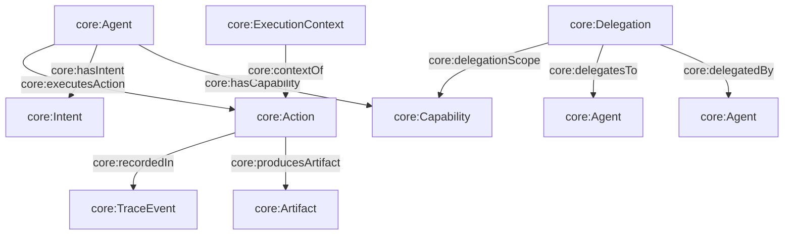

## Core Ontology (`ontologies/core.ttl`)

Defines the minimal vocabulary for executable agent semantics: **Agent**, **Capability**, **Intent**, **Delegation**, **Action**, **ExecutionContext**, and audit-friendly structures like **TraceEvent** and **Task graphs**.

### Key terms

- **Classes**
  - `core:AgentEntity`, `core:Agent`
  - `core:Capability`, `core:Intent`, `core:Delegation`
  - `core:Action`, `core:ExecutionContext`, `core:Artifact`, `core:TraceEvent`
  - `core:Task`, `core:TaskNode`, `core:TaskDependency`
- **Object properties**
  - `core:hasIntent`, `core:hasCapability`
  - `core:delegatedBy`, `core:delegatesTo`, `core:delegationScope`
  - `core:executesAction`, `core:producesArtifact`, `core:recordedIn`, `core:contextOf`
  - `core:performsTask`, `core:requiresCapability`, `core:hasSubtask`, `core:hasDependency`
- **Datatype properties**
  - `core:timestamp` (on `core:TraceEvent`), `core:description` (on `core:Artifact`)

### Upper ontology mappings

- **PROV-O**
  - `core:Agent ⊑ prov:Agent`
  - `core:Action ⊑ prov:Activity`
  - `core:Artifact ⊑ prov:Entity`
  - `core:Intent ⊑ prov:Plan`
  - `core:producesArtifact ⊑ prov:generated`
  - `core:recordedIn ⊑ prov:generated`
  - `core:timestamp ⊑ prov:generatedAtTime`
  - `core:wasAssociatedWith ⊑ prov:wasAssociatedWith` and `core:wasAssociatedWith ≡ inverse(core:executesAction)`
- **P-PLAN / EP-PLAN**
  - `core:Intent ⊑ pplan:Plan` and `⊑ epplan:Plan`
  - `core:Action ⊑ pplan:Activity` and `⊑ epplan:Activity`
  - `core:Artifact ⊑ pplan:Entity` and `⊑ epplan:Entity`
  - `core:Task ⊑ pplan:Step` and `⊑ epplan:Step`

### Hierarchy diagram



### Relationship diagram



### SPARQL queries

```sparql
PREFIX core: <https://w3id.org/agent-ontology/core#>

# 1) List agents and their capabilities
SELECT ?agent ?capability WHERE {
  ?agent a core:Agent ;
         core:hasCapability ?capability .
}
```

```sparql
PREFIX core: <https://w3id.org/agent-ontology/core#>

# 2) Actions with execution context and trace
SELECT ?action ?ctx ?trace WHERE {
  ?agent a core:Agent ; core:executesAction ?action .
  OPTIONAL { ?ctx a core:ExecutionContext ; core:contextOf ?action . }
  OPTIONAL { ?action core:recordedIn ?trace . }
}
```

### Example (Agent Trust Graph domain)

This example treats a Global.Church organization as a `core:Agent` and hangs “trust graph” edges off it via a domain extension `gc:` (endorsements/memberships/hierarchy/funding), while keeping capabilities + actions in the agent ontology.

```turtle
@prefix core: <https://w3id.org/agent-ontology/core#> .
@prefix gc: <https://global.church/ontology/gc#> .
@prefix rdfs: <http://www.w3.org/2000/01/rdf-schema#> .

gc:wycliffe-gca-eth a core:Agent ;
  rdfs:label "Wycliffe Bible Translators" ;
  core:hasCapability gc:scriptureTranslationCapability ;
  gc:hasOrganizationType gc:MissionAgency, gc:Parachurch .

gc:scriptureTranslationCapability a core:Capability ;
  rdfs:label "Scripture translation program execution" .
```

