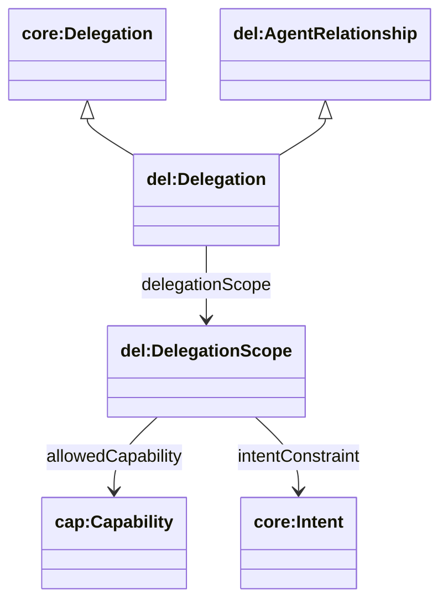
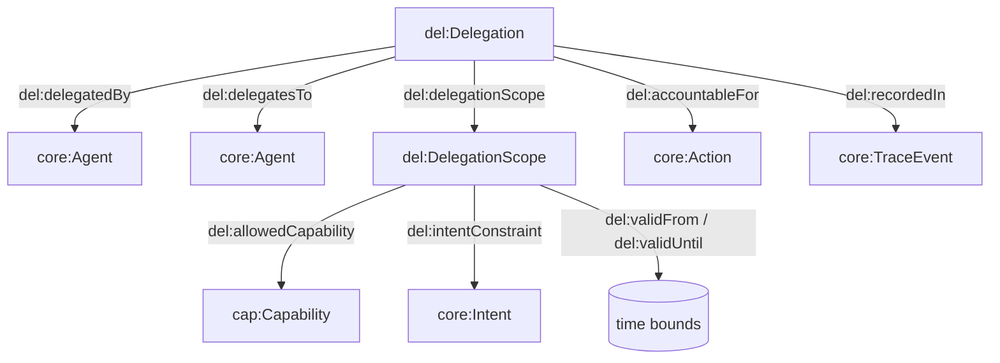

## Delegation Ontology (`ontologies/delegation.ttl`)

Defines **structured transfer of authority** between agents, including actor roles, scoped permissions (capability/intent/time bounds), delegation chains, and accountability linkages.

### Key terms

- **Classes**
  - `del:AgentRelationship`
  - `del:Delegation` (`rdfs:subClassOf core:Delegation`, `del:AgentRelationship`)
  - `del:DelegationScope`
  - `del:DelegationChain`
  - `del:ExecutionConstraint`
- **Object properties**
  - `del:delegatedBy`, `del:delegatesTo`
  - `del:delegationScope` (Delegation → DelegationScope)
  - `del:allowedCapability` (Scope → `cap:Capability`)
  - `del:intentConstraint` (Scope → `core:Intent`)
  - `del:hasDelegation` (Chain → Delegation)
  - `del:accountableFor` (Delegation → `core:Action`)
  - `del:recordedIn` (Delegation → `core:TraceEvent`)
  - `del:executionConstraint` (Scope → ExecutionConstraint)
- **Datatype properties**
  - `del:validFrom`, `del:validUntil`
  - `del:delegationId`, `del:note`

### Upper ontology mappings

- **PROV-O**
  - `del:Delegation ⊑ prov:Delegation`
  - `del:actedOnBehalfOf ⊑ prov:actedOnBehalfOf` (assert explicitly, or derive from action/activity evidence)
- **EP-PLAN**
  - `del:DelegationScope ⊑ epplan:Constraint`

### Hierarchy diagram



### Relationship diagram



### SPARQL queries

```sparql
PREFIX del: <https://w3id.org/agent-ontology/delegation#>
PREFIX cap: <https://w3id.org/agent-ontology/capability#>

# 1) Delegations and the capabilities they authorize
SELECT ?delegation ?delegatedBy ?delegatesTo ?capability WHERE {
  ?delegation a del:Delegation ;
              del:delegatedBy ?delegatedBy ;
              del:delegatesTo ?delegatesTo ;
              del:delegationScope ?scope .
  OPTIONAL { ?scope del:allowedCapability ?capability . }
}
```

```sparql
PREFIX del: <https://w3id.org/agent-ontology/delegation#>

# 2) Active delegations (time window check)
SELECT ?delegation ?from ?until WHERE {
  ?delegation del:delegationScope ?scope .
  OPTIONAL { ?scope del:validFrom ?from . }
  OPTIONAL { ?scope del:validUntil ?until . }
}
```

### Example (Agent Trust Graph domain)

Global.Church “trust graph” edges (endorsements/memberships/etc.) can coexist with **delegation** as the formal authorization for actions (including on-chain operations).

```turtle
@prefix core: <https://w3id.org/agent-ontology/core#> .
@prefix cap: <https://w3id.org/agent-ontology/capability#> .
@prefix del: <https://w3id.org/agent-ontology/delegation#> .
@prefix gc: <https://global.church/ontology/gc#> .
@prefix xsd: <http://www.w3.org/2001/XMLSchema#> .

# DAO treasury delegates a grant-disbursement capability to a giving intermediary
gc:gca-dao-treasury a core:Agent .
gc:ncf-gca-eth a core:Agent .

gc:disburseGrant a cap:Capability .

gc:delegation-2026-06 a del:Delegation ;
  del:delegatedBy gc:gca-dao-treasury ;
  del:delegatesTo gc:ncf-gca-eth ;
  del:delegationScope [
    a del:DelegationScope ;
    del:allowedCapability gc:disburseGrant ;
    del:validFrom "2026-06-01T00:00:00Z"^^xsd:dateTime ;
    del:validUntil "2026-12-31T23:59:59Z"^^xsd:dateTime
  ] ;
  del:note "Disburse grants for scripture translation pools; must be auditable." .
```

