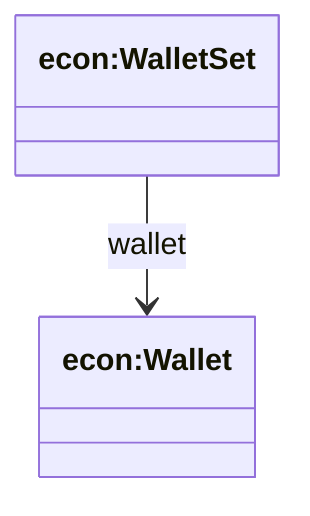
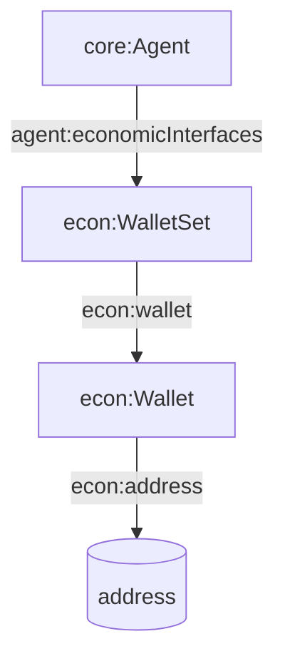

## Economic Ontology (`ontologies/economic.ttl`)

Defines a minimal wallet interface for agents: wallet sets, wallets, and addresses.

### Key terms

- **Classes**
  - `econ:WalletSet`
  - `econ:Wallet`
- **Object properties**
  - `econ:wallet` (WalletSet → Wallet)
- **Datatype properties**
  - `econ:address` (Wallet → address string)

### Hierarchy diagram



### Relationship diagram



### SPARQL queries

```sparql
PREFIX agent: <https://w3id.org/agent-ontology/agent#>
PREFIX econ: <https://w3id.org/agent-ontology/economic#>

# 1) Agents and their wallet addresses
SELECT ?agent ?address WHERE {
  ?agent agent:economicInterfaces ?ws .
  ?ws econ:wallet ?w .
  ?w econ:address ?address .
}
```

```sparql
PREFIX econ: <https://w3id.org/agent-ontology/economic#>

# 2) Wallets missing addresses
SELECT ?w WHERE {
  ?w a econ:Wallet .
  FILTER NOT EXISTS { ?w econ:address ?a . }
}
```

### Example (Agent Trust Graph domain)

```turtle
@prefix agent: <https://w3id.org/agent-ontology/agent#> .
@prefix econ: <https://w3id.org/agent-ontology/economic#> .
@prefix gc: <https://global.church/ontology/gc#> .

gc:gca-dao-treasury a agent:Organization ;
  agent:economicInterfaces [
    a econ:WalletSet ;
    econ:wallet [
      a econ:Wallet ;
      econ:address "0xDAO_TREASURY_ADDRESS"
    ]
  ] .
```

