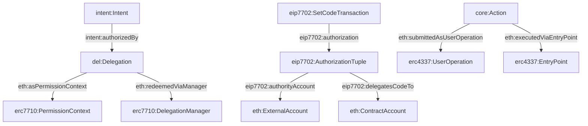

## Ethereum Intent & Delegation Overlay (`ontologies/ethereum-intent-delegation.ttl`)

Extends this repo’s `intent:` + `del:` model with Ethereum execution semantics aligned to:

- **EIP-7702**: set-code authorization tuples + delegation indicators
- **ERC-7710**: delegation redemption via delegation managers using opaque permission contexts (MetaMask delegation framework/toolkit style)
- **ERC-4337**: account abstraction flow via UserOperations and EntryPoint

### Key terms

- **EIP-7702**
  - `eip7702:SetCodeTransaction`, `eip7702:AuthorizationTuple`
  - `eip7702:authorization`, `eip7702:authorityAccount`, `eip7702:delegatesCodeTo`, `eip7702:delegationIndicator`
- **ERC-7710**
  - `erc7710:DelegationManager`, `erc7710:PermissionContext`, `erc7710:DelegationRedeemCall`
  - `erc7710:permissionContextBytes`
  - Bridge properties: `eth:asPermissionContext`, `eth:redeemedViaManager`
- **ERC-4337**
  - `erc4337:UserOperation`, `erc4337:EntryPoint`
  - Bridge properties: `eth:submittedAsUserOperation`, `eth:executedViaEntryPoint`

### Relationship diagram



### SPARQL queries

```sparql
PREFIX intent: <https://w3id.org/agent-ontology/intent#>
PREFIX eth: <https://w3id.org/agent-ontology/ethereum#>

# 1) Intents and the Ethereum authorization contexts that justify them
SELECT ?intent ?delegation ?ctx ?manager WHERE {
  ?intent intent:authorizedBy ?delegation .
  OPTIONAL { ?delegation eth:asPermissionContext ?ctx . }
  OPTIONAL { ?delegation eth:redeemedViaManager ?manager . }
}
```

```sparql
PREFIX eip7702: <https://w3id.org/agent-ontology/eip-7702#>

# 2) EIP-7702 tuples and their code delegation targets
SELECT ?tuple ?authority ?delegate ?indicator WHERE {
  ?tuple a eip7702:AuthorizationTuple .
  OPTIONAL { ?tuple eip7702:authorityAccount ?authority . }
  OPTIONAL { ?tuple eip7702:delegatesCodeTo ?delegate . }
  OPTIONAL { ?tuple eip7702:delegationIndicator ?indicator . }
}
```

### Examples

#### ERC-7710-style permission context authorization (MetaMask delegation framework)

```turtle
@prefix intent: <https://w3id.org/agent-ontology/intent#> .
@prefix del: <https://w3id.org/agent-ontology/delegation#> .
@prefix eth: <https://w3id.org/agent-ontology/ethereum#> .
@prefix erc7710: <https://w3id.org/agent-ontology/erc-7710#> .
@prefix gc: <https://global.church/ontology/gc#> .

gc:intent_disburseGrant a intent:Intent ;
  intent:authorizedBy gc:delegation_disburse_v1 .

gc:delegation_disburse_v1 a del:Delegation ;
  eth:redeemedViaManager gc:mmDelegationManager ;
  eth:asPermissionContext gc:permissionContextBlob .

gc:mmDelegationManager a erc7710:DelegationManager ;
  eth:address "0xMANAGER..." .

gc:permissionContextBlob a erc7710:PermissionContext ;
  erc7710:permissionContextBytes "0xdeadbeef..." .
```

#### EIP-7702 authorization tuple (set-code)

```turtle
@prefix eth: <https://w3id.org/agent-ontology/ethereum#> .
@prefix eip7702: <https://w3id.org/agent-ontology/eip-7702#> .
@prefix gc: <https://global.church/ontology/gc#> .

gc:setCodeTx_01 a eip7702:SetCodeTransaction .

gc:authTuple_01 a eip7702:AuthorizationTuple ;
  eip7702:authorityAccount gc:someEoa ;
  eip7702:delegatesCodeTo gc:delegateContract ;
  eip7702:delegationIndicator "0xef0100..." .

gc:someEoa a eth:ExternalAccount ; eth:address "0xEOA..." .
gc:delegateContract a eth:ContractAccount ; eth:address "0xDELEGATE..." .
```

### References

- `EIP-7702`: `https://eips.ethereum.org/EIPS/eip-7702`
- `ERC-7710`: `https://eips.ethereum.org/EIPS/eip-7710`
- `ERC-4337`: `https://eips.ethereum.org/EIPS/eip-4337`
- MetaMask delegation toolkit: `https://github.com/MetaMask/delegation-toolkit`
- MetaMask delegation framework: `https://github.com/metamask/delegation-framework`

