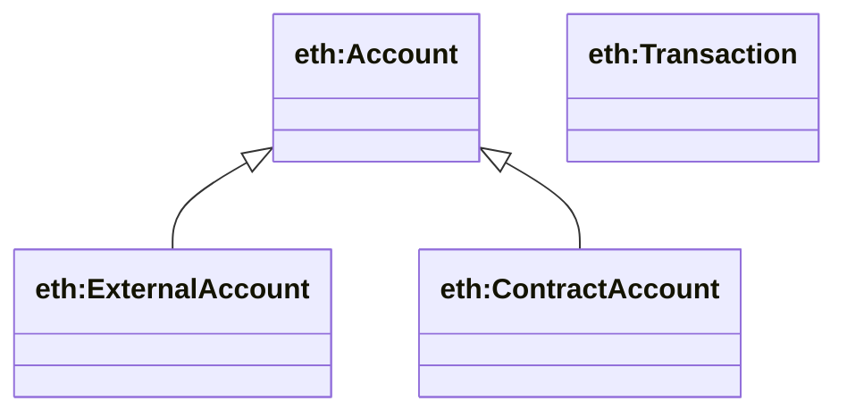
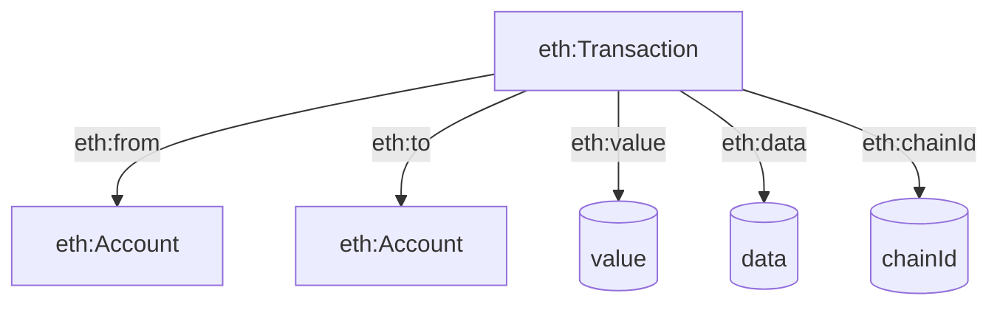

## Ethereum Ontology Bridge (`ontologies/ethereum.ttl`)

Provides a minimal Ethereum vocabulary aligned to **EthOn** and grounded in **PROV-O**. This module exists to give your agent ontology a stable base for expressing *accounts, transactions, and basic transaction fields* before layering on EIP/ERC-specific semantics.

### Key terms

- **Classes**
  - `eth:Account` (aligned to `ethon:Account`, and treated as `prov:Entity`)
  - `eth:ExternalAccount` (EOA)
  - `eth:ContractAccount` (smart contract)
  - `eth:Transaction` (aligned to `ethon:Tx`, and treated as `prov:Activity`)
- **Datatype properties**
  - `eth:address`, `eth:value`, `eth:data`, `eth:nonce`, `eth:chainId`, `eth:signature`
- **Object properties**
  - `eth:from`, `eth:to`

### Hierarchy diagram



### Relationship diagram



### SPARQL queries

```sparql
PREFIX eth: <https://w3id.org/agent-ontology/ethereum#>

# 1) List EOAs and their addresses
SELECT ?acct ?addr WHERE {
  ?acct a eth:ExternalAccount ;
        eth:address ?addr .
}
```

```sparql
PREFIX eth: <https://w3id.org/agent-ontology/ethereum#>

# 2) Transactions by sender
SELECT ?tx ?to ?value ?chainId WHERE {
  ?tx a eth:Transaction ;
      eth:from ?from .
  OPTIONAL { ?tx eth:to ?to . }
  OPTIONAL { ?tx eth:value ?value . }
  OPTIONAL { ?tx eth:chainId ?chainId . }
}
```

### Example (Agent Trust Graph / ENS domain)

```turtle
@prefix eth: <https://w3id.org/agent-ontology/ethereum#> .
@prefix gc: <https://global.church/ontology/gc#> .
@prefix xsd: <http://www.w3.org/2001/XMLSchema#> .

gc:graceCommunityEoa a eth:ExternalAccount ;
  eth:address "0x1234...abcd" .

gc:gcaDaoTreasury a eth:ContractAccount ;
  eth:address "0xDAO...treasury" .

gc:tx_0001 a eth:Transaction ;
  eth:from gc:graceCommunityEoa ;
  eth:to gc:gcaDaoTreasury ;
  eth:value "50000"^^xsd:decimal ;
  eth:chainId 1 .
```

