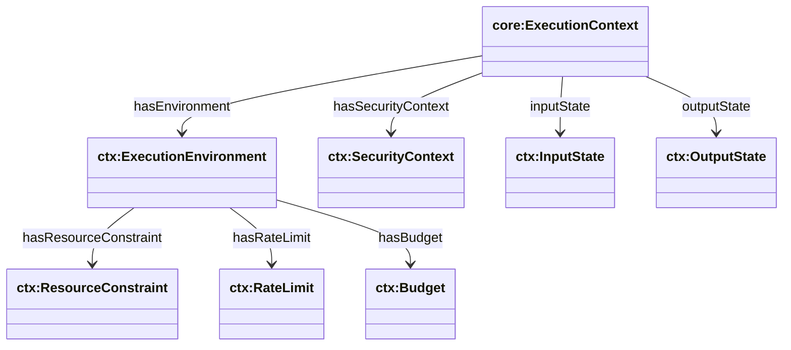
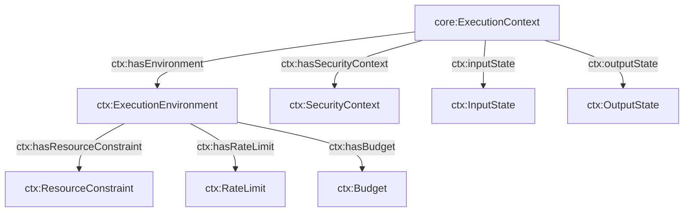

## Execution Context Ontology (`ontologies/execution-context.ttl`)

Defines the **execution environment** for agent actions: environment type (sandbox/container/TEE), security context, input/output state capture, and resource constraints (rate limits, budgets, CPU/memory-like constraints).

### Key terms

- **Classes**
  - `ctx:ExecutionEnvironment`, `ctx:SecurityContext`
  - `ctx:InputState`, `ctx:OutputState`
  - `ctx:ResourceConstraint`, `ctx:RateLimit`, `ctx:Budget`
- **Object properties**
  - `ctx:hasEnvironment` (domain `core:ExecutionContext`)
  - `ctx:hasSecurityContext` (domain `core:ExecutionContext`)
  - `ctx:inputState`, `ctx:outputState` (domain `core:ExecutionContext`)
  - `ctx:hasResourceConstraint` (Environment → ResourceConstraint)
  - `ctx:hasRateLimit` (Environment → RateLimit)
  - `ctx:hasBudget` (Environment → Budget)
- **Datatype properties**
  - `ctx:envType`, `ctx:usesTEE`, `ctx:usesKeySlot`
  - `ctx:inputValue`, `ctx:outputValue`
  - `ctx:constraintType`, `ctx:constraintValue`
  - `ctx:maxRequests`, `ctx:perSeconds`
  - `ctx:amount`, `ctx:currency`

### Upper ontology mappings

- **PROV-O / EP-PLAN**
  - `ctx:ExecutionEnvironment ⊑ prov:Entity` and `⊑ epplan:Entity`
  - `ctx:SecurityContext ⊑ prov:Entity` and `⊑ epplan:Entity`
  - `ctx:InputState ⊑ prov:Entity` and `⊑ epplan:Entity`
  - `ctx:OutputState ⊑ prov:Entity` and `⊑ epplan:Entity`

### Hierarchy diagram



### Relationship diagram



### SPARQL queries

```sparql
PREFIX core: <https://w3id.org/agent-ontology/core#>
PREFIX ctx: <https://w3id.org/agent-ontology/execution-context#>

# 1) Actions and their execution environments
SELECT ?action ?envType WHERE {
  ?ec a core:ExecutionContext ; core:contextOf ?action .
  ?ec ctx:hasEnvironment ?env .
  OPTIONAL { ?env ctx:envType ?envType . }
}
```

```sparql
PREFIX ctx: <https://w3id.org/agent-ontology/execution-context#>

# 2) Find contexts that require a TEE
SELECT ?ec WHERE {
  ?ec ctx:hasSecurityContext ?sc .
  ?sc ctx:usesTEE true .
}
```

### Example (Agent Trust Graph domain)

```turtle
@prefix core: <https://w3id.org/agent-ontology/core#> .
@prefix ctx: <https://w3id.org/agent-ontology/execution-context#> .
@prefix gc: <https://global.church/ontology/gc#> .
@prefix xsd: <http://www.w3.org/2001/XMLSchema#> .

gc:action-disburse-grant-001 a core:Action .

gc:execctx-disburse-grant-001 a core:ExecutionContext ;
  core:contextOf gc:action-disburse-grant-001 ;
  ctx:hasEnvironment [
    a ctx:ExecutionEnvironment ;
    ctx:envType "container" ;
    ctx:hasRateLimit [ a ctx:RateLimit ; ctx:maxRequests 10 ; ctx:perSeconds 60 ] ;
    ctx:hasBudget [ a ctx:Budget ; ctx:amount "50000"^^xsd:decimal ; ctx:currency "USD" ]
  ] ;
  ctx:hasSecurityContext [
    a ctx:SecurityContext ;
    ctx:usesTEE true ;
    ctx:usesKeySlot "hsm-slot-7"
  ] .
```

