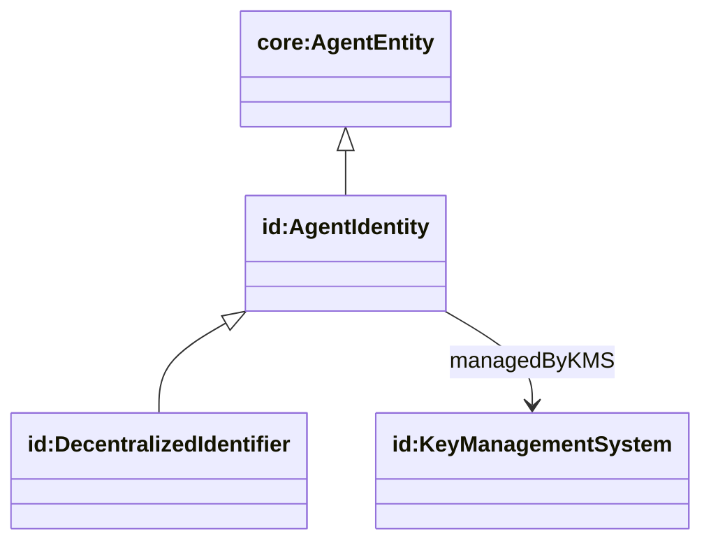
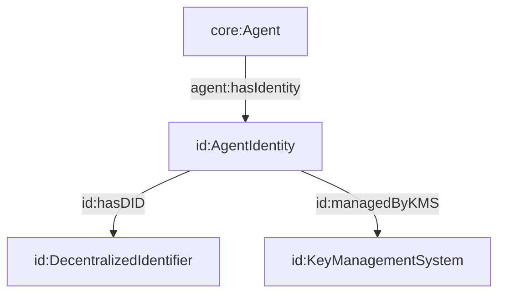

## Identity Ontology (`ontologies/identity.ttl`)

Defines verifiable identity for agents: `AgentIdentity` containers, DIDs, and key management systems. This is where you bind real-world identifiers (e.g., ENS name, DID) to an agent instance.

### Key terms

- **Classes**
  - `id:AgentIdentity` (`rdfs:subClassOf core:AgentEntity`)
  - `id:DecentralizedIdentifier` (`rdfs:subClassOf id:AgentIdentity`)
  - `id:KeyManagementSystem`
- **Object properties**
  - `id:hasDID` (AgentIdentity → DecentralizedIdentifier)
  - `id:managedByKMS` (AgentIdentity → KeyManagementSystem)
- **Datatype properties**
  - `id:did`, `id:version`, `id:title`
  - `id:kmsEndpoint`

### Hierarchy diagram



### Relationship diagram



### SPARQL queries

```sparql
PREFIX agent: <https://w3id.org/agent-ontology/agent#>
PREFIX id: <https://w3id.org/agent-ontology/identity#>

# 1) Agents and their identity titles (e.g., ENS name)
SELECT ?agent ?title WHERE {
  ?agent agent:hasIdentity ?ident .
  OPTIONAL { ?ident id:title ?title . }
}
```

```sparql
PREFIX id: <https://w3id.org/agent-ontology/identity#>

# 2) DIDs missing KMS bindings
SELECT ?ident ?did WHERE {
  ?ident a id:AgentIdentity ;
         id:did ?did .
  FILTER NOT EXISTS { ?ident id:managedByKMS ?kms . }
}
```

### Example (Agent Trust Graph domain)

```turtle
@prefix agent: <https://w3id.org/agent-ontology/agent#> .
@prefix id: <https://w3id.org/agent-ontology/identity#> .
@prefix gc: <https://global.church/ontology/gc#> .
@prefix xsd: <http://www.w3.org/2001/XMLSchema#> .

gc:wycliffe-gca-eth a agent:Organization ;
  agent:hasIdentity [
    a id:AgentIdentity ;
    id:title "wycliffe.gca.eth" ;
    id:did "did:web:wycliffe.org" ;
    id:version "1"
  ] .
```

