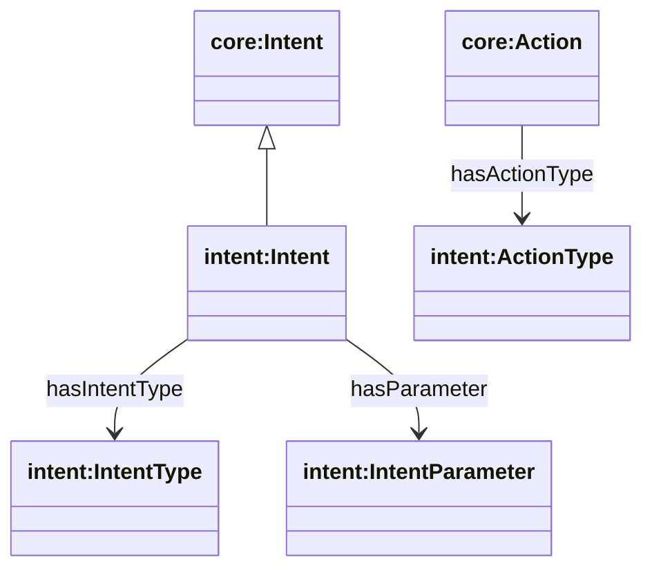
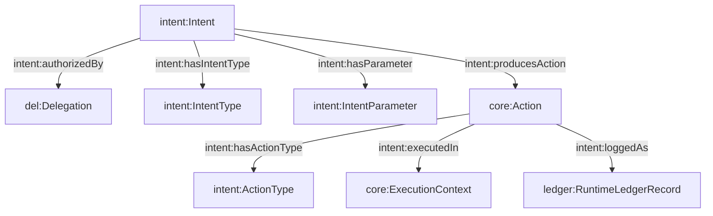

## Intent Ontology (`ontologies/intent.ttl`)

Defines how agents express **purpose** in a structured way, and how intents yield actions that execute within a context and get logged. Also provides hooks to **delegation authorization**.

### Key terms

- **Classes**
  - `intent:Intent`
  - `intent:IntentType`
  - `intent:IntentParameter`
  - `intent:ActionType`
- **Object properties**
  - `intent:hasIntentType` (Intent → IntentType)
  - `intent:hasParameter` (Intent → IntentParameter)
  - `intent:authorizedBy` (Intent → `del:Delegation`)
  - `intent:producesAction` (Intent → `core:Action`)
  - `intent:hasActionType` (Action → ActionType)
  - `intent:executedIn` (Action → `core:ExecutionContext`)
  - `intent:loggedAs` (Action → `ledger:RuntimeLedgerRecord`)
- **Datatype properties**
  - `intent:paramName`, `intent:paramType`, `intent:paramValue`

### Note

`intent:loggedAs` points to `ledger:RuntimeLedgerRecord`, which is not currently defined in `ontologies/ledger.ttl` (the closest defined class is `ledger:RuntimeLedgerEvent`).

### Hierarchy diagram



### Relationship diagram



### SPARQL queries

```sparql
PREFIX intent: <https://w3id.org/agent-ontology/intent#>
PREFIX del: <https://w3id.org/agent-ontology/delegation#>

# 1) Intents and their authorization basis
SELECT ?intent ?delegation WHERE {
  ?intent a intent:Intent .
  OPTIONAL { ?intent intent:authorizedBy ?delegation . }
}
```

```sparql
PREFIX intent: <https://w3id.org/agent-ontology/intent#>

# 2) Expand intent parameters (name/type/value)
SELECT ?intent ?name ?type ?value WHERE {
  ?intent intent:hasParameter ?p .
  OPTIONAL { ?p intent:paramName ?name . }
  OPTIONAL { ?p intent:paramType ?type . }
  OPTIONAL { ?p intent:paramValue ?value . }
}
```

### Example (Agent Trust Graph domain)

```turtle
@prefix core: <https://w3id.org/agent-ontology/core#> .
@prefix intent: <https://w3id.org/agent-ontology/intent#> .
@prefix del: <https://w3id.org/agent-ontology/delegation#> .
@prefix gc: <https://global.church/ontology/gc#> .

# "Fund scripture translation for the Shaikh people group"
gc:intent-fund-shaikh-translation a intent:Intent ;
  intent:hasIntentType gc:fundingIntentType ;
  intent:authorizedBy gc:delegation-2026-06 ;
  intent:hasParameter [
    a intent:IntentParameter ;
    intent:paramName "peopleGroup" ;
    intent:paramType "gc:PeopleGroup" ;
    intent:paramValue "gc:Shaikh"
  ] ;
  intent:hasParameter [
    a intent:IntentParameter ;
    intent:paramName "amount" ;
    intent:paramType "xsd:decimal" ;
    intent:paramValue "50000"
  ] .

gc:fundingIntentType a intent:IntentType .
gc:delegation-2026-06 a del:Delegation .
```

