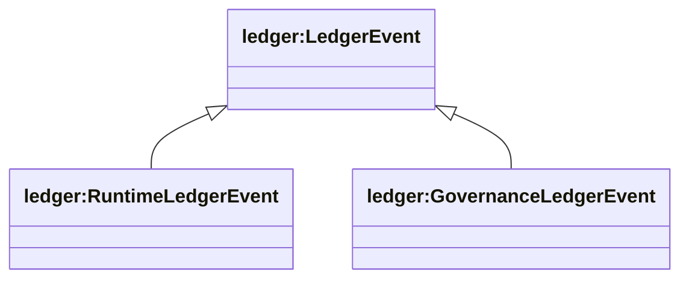
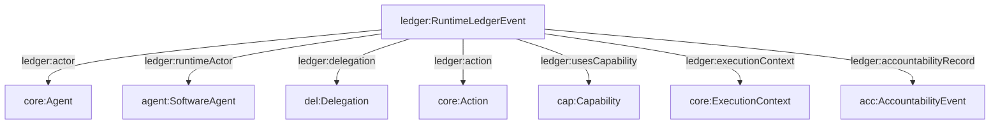

## Ledger Ontology (`ontologies/ledger.ttl`)

Defines **verifiable, append-only records** of agent events (runtime + governance), including integrity proofs, delegation binding, capability usage, execution context linkage, and accountability references.

### Key terms

- **Classes**
  - `ledger:LedgerEvent`
  - `ledger:RuntimeLedgerEvent`, `ledger:GovernanceLedgerEvent`
- **Datatype properties**
  - `ledger:eventId`, `ledger:timestamp`
  - `ledger:previousEventHash`, `ledger:appendOnly`
  - `ledger:hash`, `ledger:signature`, `ledger:publicKey`, `ledger:proofType`, `ledger:verifiedBy`
  - `ledger:intent`, `ledger:capabilityVersion`
  - `ledger:environment`, `ledger:hardwareAnchor`, `ledger:sandboxProfile`
  - `ledger:sideEffect`, `ledger:stateChange`
  - `ledger:aiActSection`, `ledger:riskClassification`
- **Object properties**
  - `ledger:actor` → `core:Agent`
  - `ledger:runtimeActor` → `agent:SoftwareAgent` (the executing software agent; distinct from responsible principal)
  - `ledger:delegation` → `del:Delegation`
  - `ledger:action` → `core:Action`
  - `ledger:usesCapability` → `cap:Capability`
  - `ledger:executionContext` → `core:ExecutionContext`
  - `ledger:result` → `core:ExecutionResult`
  - `ledger:accountabilityRecord` → `acc:AccountabilityEvent`
  - `ledger:governanceAction` → `ledger:GovernanceAction`
  - `ledger:specVersion` → `ledger:SpecVersion`

### Note

`ledger:result` uses range `core:ExecutionResult`, which is referenced in `ontologies/ledger.ttl` but not currently defined in `ontologies/core.ttl`.

### Hierarchy diagram



### Relationship diagram



### SPARQL queries

```sparql
PREFIX ledger: <https://w3id.org/agent-ontology/ledger#>

# 1) Latest runtime events (if your store supports ORDER/LIMIT)
SELECT ?event ?ts ?actor WHERE {
  ?event a ledger:RuntimeLedgerEvent ;
         ledger:timestamp ?ts ;
         ledger:actor ?actor .
}
ORDER BY DESC(?ts)
LIMIT 50
```

```sparql
PREFIX ledger: <https://w3id.org/agent-ontology/ledger#>

# 2) Find events lacking signatures (gap detection)
SELECT ?event WHERE {
  ?event a ledger:LedgerEvent .
  FILTER NOT EXISTS { ?event ledger:signature ?sig . }
}
```

### Example (Agent Trust Graph domain)

```turtle
@prefix ledger: <https://w3id.org/agent-ontology/ledger#> .
@prefix core: <https://w3id.org/agent-ontology/core#> .
@prefix cap: <https://w3id.org/agent-ontology/capability#> .
@prefix del: <https://w3id.org/agent-ontology/delegation#> .
@prefix agent: <https://w3id.org/agent-ontology/agent#> .
@prefix gc: <https://global.church/ontology/gc#> .
@prefix xsd: <http://www.w3.org/2001/XMLSchema#> .

gc:ledger-event-0001 a ledger:RuntimeLedgerEvent ;
  ledger:eventId "evt_0001" ;
  ledger:timestamp "2026-06-15T12:00:00Z"^^xsd:dateTime ;
  ledger:actor gc:ncf-gca-eth ;
  ledger:runtimeActor gc:grant-disburser-bot ;
  ledger:delegation gc:delegation-2026-06 ;
  ledger:action gc:action-disburse-grant-001 ;
  ledger:usesCapability gc:disburseGrant ;
  ledger:environment "container" ;
  ledger:sandboxProfile "gca-prod-strict" ;
  ledger:signature "0xabc123..." .

gc:ncf-gca-eth a agent:Organization .
gc:grant-disburser-bot a agent:SoftwareAgent .
gc:delegation-2026-06 a del:Delegation .
gc:action-disburse-grant-001 a core:Action .
gc:disburseGrant a cap:Capability .
```

