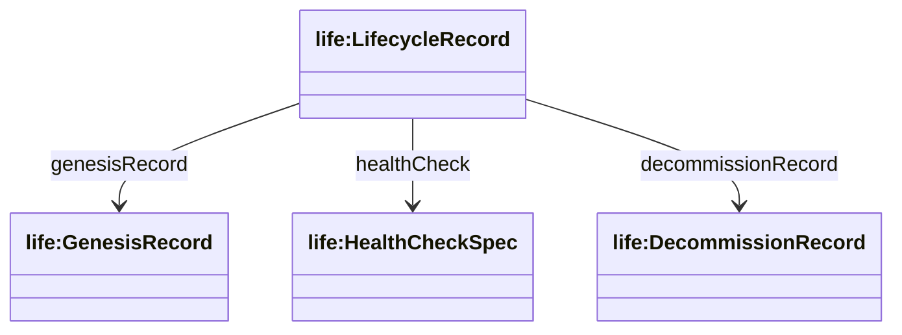
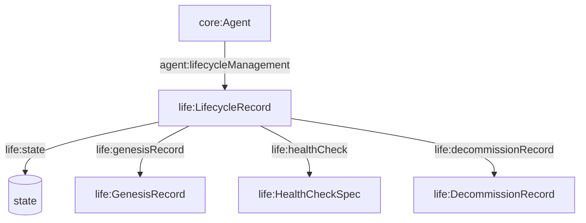

## Lifecycle Ontology (`ontologies/lifecycle.ttl`)

Defines a minimal lifecycle record for agents: genesis record, health checks, state, and decommission record.

### Key terms

- **Classes**
  - `life:LifecycleRecord`
  - `life:GenesisRecord`
  - `life:HealthCheckSpec`
  - `life:DecommissionRecord`
- **Object properties**
  - `life:genesisRecord` (LifecycleRecord → GenesisRecord)
  - `life:healthCheck` (LifecycleRecord → HealthCheckSpec)
  - `life:decommissionRecord` (LifecycleRecord → DecommissionRecord)
- **Datatype properties**
  - `life:state` (LifecycleRecord → string)

### Hierarchy diagram



### Relationship diagram



### SPARQL queries

```sparql
PREFIX agent: <https://w3id.org/agent-ontology/agent#>
PREFIX life: <https://w3id.org/agent-ontology/lifecycle#>

# 1) Agents and lifecycle states
SELECT ?agent ?state WHERE {
  ?agent agent:lifecycleManagement ?lr .
  OPTIONAL { ?lr life:state ?state . }
}
```

```sparql
PREFIX life: <https://w3id.org/agent-ontology/lifecycle#>

# 2) Decommissioned agents (has decommission record)
SELECT ?lr ?decom WHERE {
  ?lr a life:LifecycleRecord ;
      life:decommissionRecord ?decom .
}
```

### Example (Agent Trust Graph domain)

```turtle
@prefix agent: <https://w3id.org/agent-ontology/agent#> .
@prefix life: <https://w3id.org/agent-ontology/lifecycle#> .
@prefix gc: <https://global.church/ontology/gc#> .

gc:lausanne-gca-eth a agent:Organization ;
  agent:lifecycleManagement [
    a life:LifecycleRecord ;
    life:state "active" ;
    life:genesisRecord [ a life:GenesisRecord ] ;
    life:healthCheck [ a life:HealthCheckSpec ]
  ] .
```

