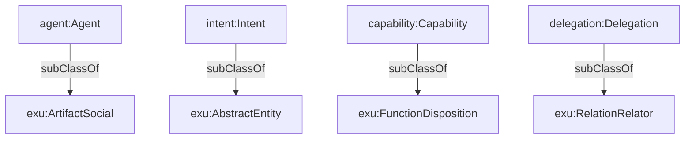

## Ontic Alignment (`ontologies/ontic-alignment.ttl`)

Provides **upper-ontology grounding** (via a “Unified Ontic Ontology” alignment) for core agent concepts. This is not a full upper ontology; it’s a lightweight mapping layer that says what kind of thing an Agent/Intent/Capability/etc. *is*, ontically.

### What it aligns

- `agent:Agent` → `exu:ArtifactSocial` (social artifact / social object)
- `intent:Intent` → `exu:AbstractEntity` (abstract/generically dependent continuant)
- `capability:Capability` → `exu:FunctionDisposition` (realizable entity/disposition/function)
- `contract:Contract` → `exu:ArtifactSocial`
- `ledger:Ledger` → `exu:ArtifactSocial` / information artifact
- `delegation:Delegation` → `exu:RelationRelator`
- `security:ProofBinding` → `exu:DependentContinuant`

### Relationship diagram



### SPARQL queries

```sparql
PREFIX exu: <http://example.org/unified-ontic#>
PREFIX capability: <https://s-agent-comm.github.io/ontology/ontologies/capability#>

# 1) Check that capability is grounded as a FunctionDisposition
ASK { capability:Capability rdfs:subClassOf exu:FunctionDisposition . }
```

```sparql
PREFIX exu: <http://example.org/unified-ontic#>

# 2) List aligned classes and their target ontic categories
SELECT ?class ?ontic WHERE {
  ?class rdfs:subClassOf ?ontic .
  FILTER(STRSTARTS(STR(?ontic), STR(exu:)))
}
```

### Example (Agent Trust Graph domain)

Use this layer to justify claims like: “An organization-agent is a social artifact with realizable capabilities; endorsements/memberships are social relations/relators; execution evidence binds into dependent continuants (proof bindings).”

