## Main Ontology (`ontologies/ontology.ttl`)

This is the **umbrella entry point** for the full AI Agent Ontology. It imports all constituent modules so tooling can load one URL/file and get the complete model.

### Imports (module dependency graph)

```mermaid
graph TD
  O[ontologies/ontology.ttl] --> core[core]
  O --> agent[agent]
  O --> aiAgent[ai-agent]
  O --> eth[ethereum]
  O --> ethOverlay[ethereum-intent-delegation]
  O --> capability[capability]
  O --> delegation[delegation]
  O --> accountability[accountability]
  O --> ledger[ledger]
  O --> identity[identity]
  O --> agentProfile[agent-profile]
  O --> execCtx[execution-context]
  O --> intent[intent]
  O --> security[security-binding]
  O --> payment[payment]
  O --> economic[economic]
  O --> lifecycle[lifecycle]
  O --> contract[contract]
  O --> schemaMap[schema-org-mapping]
```



### SPARQL queries

```sparql
# Useful generic prefixes for the full ontology
PREFIX core: <https://w3id.org/agent-ontology/core#>
PREFIX agent: <https://w3id.org/agent-ontology/agent#>
PREFIX cap: <https://w3id.org/agent-ontology/capability#>
PREFIX del: <https://w3id.org/agent-ontology/delegation#>
PREFIX intent: <https://w3id.org/agent-ontology/intent#>
PREFIX ledger: <https://w3id.org/agent-ontology/ledger#>
PREFIX acc: <https://w3id.org/agent-ontology/accountability#>
PREFIX id: <https://w3id.org/agent-ontology/identity#>
PREFIX sec: <https://w3id.org/agent-ontology/security-binding#>
PREFIX payment: <https://w3id.org/agent-ontology/payment#>
PREFIX econ: <https://w3id.org/agent-ontology/economic#>
PREFIX life: <https://w3id.org/agent-ontology/lifecycle#>
PREFIX contract: <https://w3id.org/agent-ontology/contract#>
```

```sparql
PREFIX owl: <http://www.w3.org/2002/07/owl#>

# 1) List all imported ontologies from the umbrella
SELECT ?imported WHERE {
  <https://w3id.org/agent-ontology/ontology> owl:imports ?imported .
}
```

```sparql
PREFIX core: <https://w3id.org/agent-ontology/core#>

# 2) Quick sanity: show the core vocabulary surface
SELECT ?p WHERE {
  { core:Agent ?p ?o } UNION { ?s ?p core:Agent }
}
LIMIT 50
```

### Example (Agent Trust Graph domain)

For Global.Church, you typically load this umbrella ontology, then layer a domain vocabulary (e.g., `gc:` for endorsements/memberships/org types) on top.

