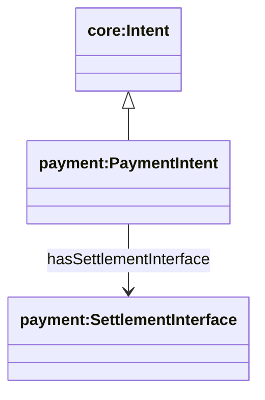
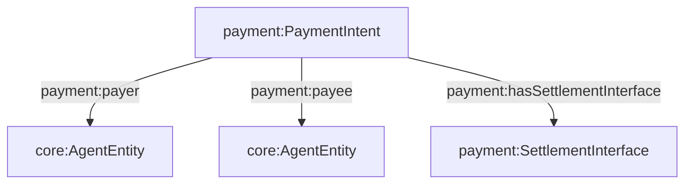

## Payment Ontology (`ontologies/payment.ttl`)

Defines payment intents and settlement interfaces: who pays whom, why, how much, and what settlement methods are acceptable.

### Key terms

- **Classes**
  - `payment:PaymentIntent` (`rdfs:subClassOf core:Intent`)
  - `payment:SettlementInterface`
- **Object properties**
  - `payment:payer` → `core:AgentEntity`
  - `payment:payee` → `core:AgentEntity`
  - `payment:hasSettlementInterface` → `payment:SettlementInterface`
- **Datatype properties**
  - `payment:reason`, `payment:amount`, `payment:unit`
  - `payment:acceptedMethod`, `payment:category`

### Hierarchy diagram



### Relationship diagram



### SPARQL queries

```sparql
PREFIX payment: <https://w3id.org/agent-ontology/payment#>

# 1) Payment intents by payer
SELECT ?intent ?payee ?amount ?unit WHERE {
  ?intent a payment:PaymentIntent ;
          payment:payer ?payer ;
          payment:payee ?payee ;
          payment:amount ?amount ;
          payment:unit ?unit .
}
```

```sparql
PREFIX payment: <https://w3id.org/agent-ontology/payment#>

# 2) Settlement methods used/accepted
SELECT ?intent ?method WHERE {
  ?intent payment:hasSettlementInterface ?si .
  OPTIONAL { ?si payment:acceptedMethod ?method . }
}
```

### Example (Agent Trust Graph domain)

```turtle
@prefix payment: <https://w3id.org/agent-ontology/payment#> .
@prefix agent: <https://w3id.org/agent-ontology/agent#> .
@prefix gc: <https://global.church/ontology/gc#> .
@prefix xsd: <http://www.w3.org/2001/XMLSchema#> .

gc:grace-community-gca-eth a agent:Organization .
gc:gca-dao-treasury a agent:Organization .

gc:payintent-0001 a payment:PaymentIntent ;
  payment:payer gc:grace-community-gca-eth ;
  payment:payee gc:gca-dao-treasury ;
  payment:reason "Fund scripture translation for the Shaikh people group" ;
  payment:amount "50000"^^xsd:decimal ;
  payment:unit "USD" ;
  payment:hasSettlementInterface [
    a payment:SettlementInterface ;
    payment:acceptedMethod "ERC-20 (USDC)" ;
    payment:category "grant"
  ] .
```

