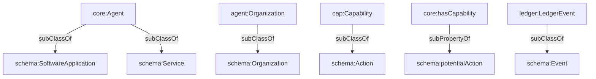

## Schema.org Mapping (`ontologies/schema-org-mapping.ttl`)

Provides semantic mappings from this agent ontology to Schema.org to improve interoperability/discoverability (e.g., publishing agent metadata for web indexing).

### Key mappings

- `core:Agent` `rdfs:subClassOf` `schema:SoftwareApplication` and `schema:Service`
- `agent:Person` `rdfs:subClassOf` `schema:Person`
- `agent:Organization` `rdfs:subClassOf` `schema:Organization`
- `core:hasCapability` `rdfs:subPropertyOf` `schema:potentialAction`
- `cap:Capability` and `cap:Skill` `rdfs:subClassOf` `schema:Action`
- `del:AgentRelationship` `rdfs:subClassOf` `schema:Role`
- `contract:Contract` `rdfs:subClassOf` `schema:Contract`
- `intent:Intent` `rdfs:subClassOf` `schema:Intent`
- `core:Action` `rdfs:subClassOf` `schema:Action`
- `ledger:LedgerEvent` `rdfs:subClassOf` `schema:Event`

### Relationship diagram



### SPARQL queries

```sparql
PREFIX schema: <http://schema.org/>
PREFIX core: <https://w3id.org/agent-ontology/core#>

# 1) Verify that core:Agent is mapped to both SoftwareApplication and Service
ASK {
  core:Agent rdfs:subClassOf schema:SoftwareApplication .
  core:Agent rdfs:subClassOf schema:Service .
}
```

```sparql
PREFIX schema: <http://schema.org/>
PREFIX core: <https://w3id.org/agent-ontology/core#>

# 2) Find properties mapped under schema:potentialAction
SELECT ?p WHERE {
  ?p rdfs:subPropertyOf schema:potentialAction .
}
```

### Example (Agent Trust Graph domain)

In the Global.Church context, this mapping lets you publish an org-agent in a Schema.org-friendly way without losing the graph semantics internally.

```turtle
@prefix core: <https://w3id.org/agent-ontology/core#> .
@prefix agent: <https://w3id.org/agent-ontology/agent#> .
@prefix schema: <http://schema.org/> .
@prefix gc: <https://global.church/ontology/gc#> .

gc:ecfa-gca-eth a agent:Organization ;
  schema:name "ECFA" ;
  schema:potentialAction gc:accreditOrganizationsCapability .

gc:accreditOrganizationsCapability a core:Capability .
```

