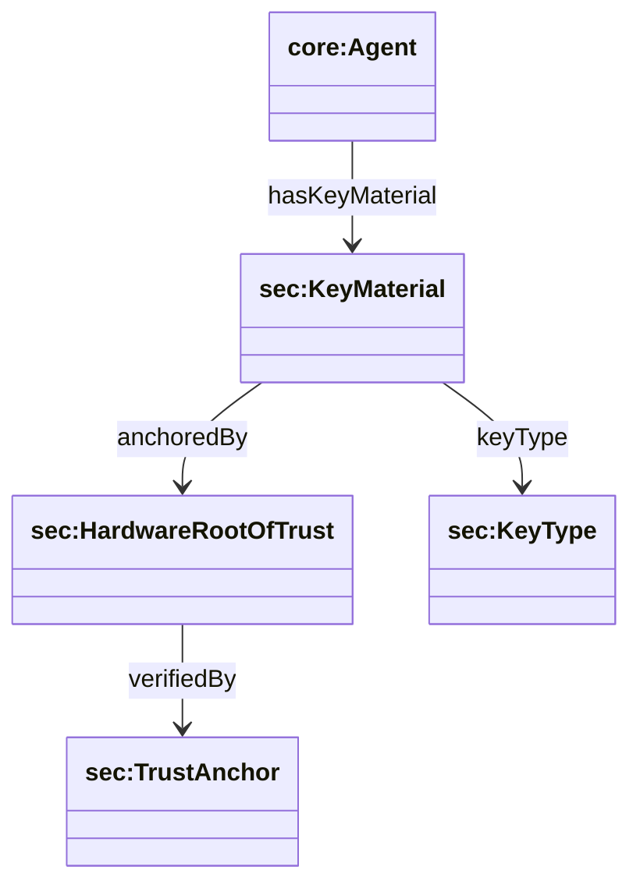
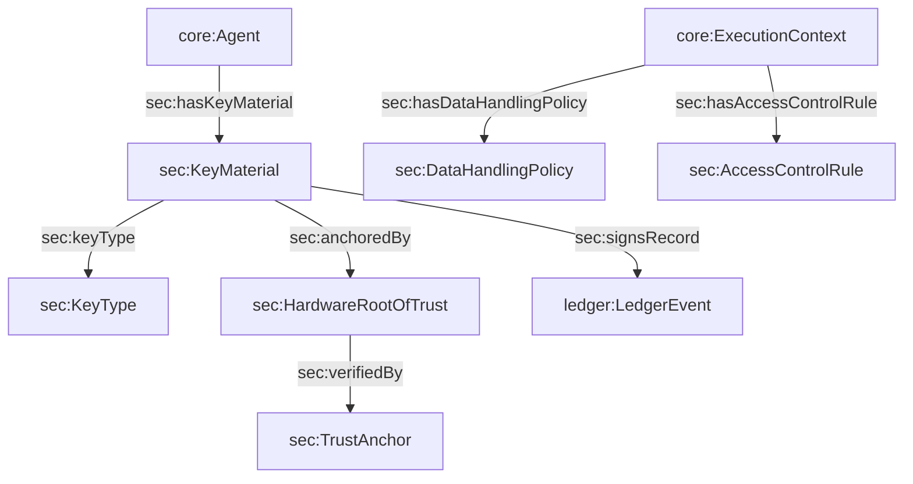

## Security Binding Ontology (`ontologies/security-binding.ttl`)

Defines the **trust chain** from identity to execution evidence: DID → key material → hardware root of trust → ledger verification. Also includes minimal axioms useful for threat mitigation (e.g., capability disjointness, intent↔task linkage, access-control policies).

### Key terms

- **Classes**
  - `sec:SecurityBinding`
  - `sec:KeyMaterial`, `sec:KeyType`
  - `sec:HardwareRootOfTrust`, `sec:TrustAnchor`
  - `sec:CriticalCapability`, `sec:RestrictedCapability`
  - `sec:DataHandlingPolicy`, `sec:AccessControlRule`
- **Object properties**
  - `sec:hasKeyMaterial` (domain `core:Agent`)
  - `sec:keyType` (KeyMaterial → KeyType)
  - `sec:anchoredBy` (KeyMaterial → HardwareRootOfTrust)
  - `sec:verifiedBy` (HardwareRootOfTrust → TrustAnchor)
  - `sec:signsRecord` (KeyMaterial → `ledger:LedgerEvent`)
  - `sec:IntentAlignsWithTask` (Intent → Task)
  - `sec:hasDataHandlingPolicy` (domain `core:ExecutionContext`)
  - `sec:hasAccessControlRule` (domain `core:ExecutionContext`)
- **Datatype properties**
  - `sec:keyValue`, `sec:attestationReport`, `sec:trustLevel`
  - `sec:policyURI`, `sec:encryptionRequired`
  - `sec:allowedAction`, `sec:restrictedToRole`

### Hierarchy diagram



### Relationship diagram



### SPARQL queries

```sparql
PREFIX sec: <https://w3id.org/agent-ontology/security-binding#>
PREFIX core: <https://w3id.org/agent-ontology/core#>

# 1) Agents with key material but missing hardware anchors
SELECT ?agent ?km WHERE {
  ?agent a core:Agent ; sec:hasKeyMaterial ?km .
  FILTER NOT EXISTS { ?km sec:anchoredBy ?hw . }
}
```

```sparql
PREFIX sec: <https://w3id.org/agent-ontology/security-binding#>

# 2) Execution contexts that require encryption
SELECT ?ec ?policy WHERE {
  ?ec sec:hasDataHandlingPolicy ?policy .
  ?policy sec:encryptionRequired true .
}
```

### Example (Agent Trust Graph domain)

```turtle
@prefix agent: <https://w3id.org/agent-ontology/agent#> .
@prefix sec: <https://w3id.org/agent-ontology/security-binding#> .
@prefix ledger: <https://w3id.org/agent-ontology/ledger#> .
@prefix gc: <https://global.church/ontology/gc#> .

gc:wycliffe-gca-eth a agent:Organization ;
  sec:hasKeyMaterial gc:key-1 .

gc:key-1 a sec:KeyMaterial ;
  sec:keyType gc:secp256k1 ;
  sec:anchoredBy gc:tee-az-1 ;
  sec:signsRecord gc:ledger-record-0001 .

gc:tee-az-1 a sec:HardwareRootOfTrust ;
  sec:verifiedBy gc:trust-anchor-ecfa ;
  sec:trustLevel "attested" .

gc:trust-anchor-ecfa a sec:TrustAnchor .

gc:ledger-record-0001 a ledger:LedgerEvent .
gc:secp256k1 a sec:KeyType .
```

