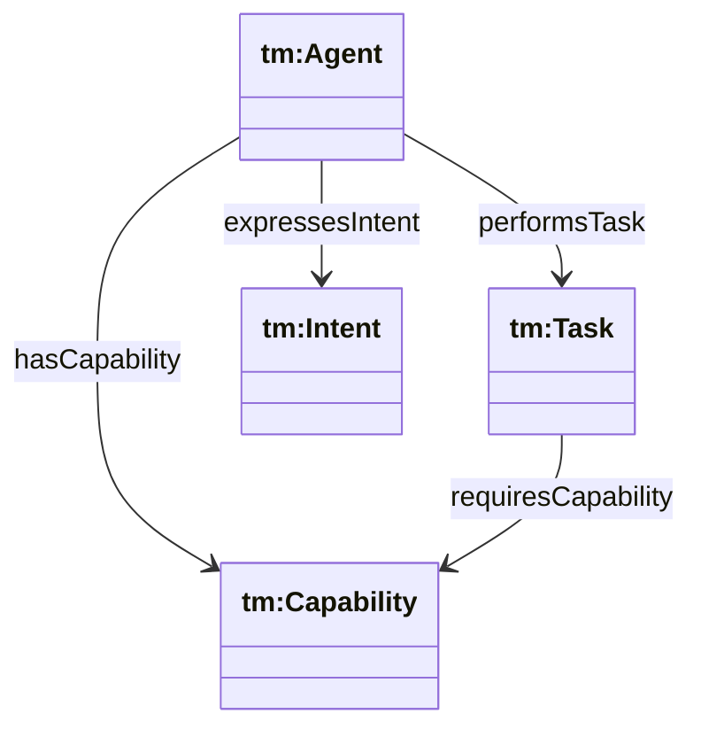
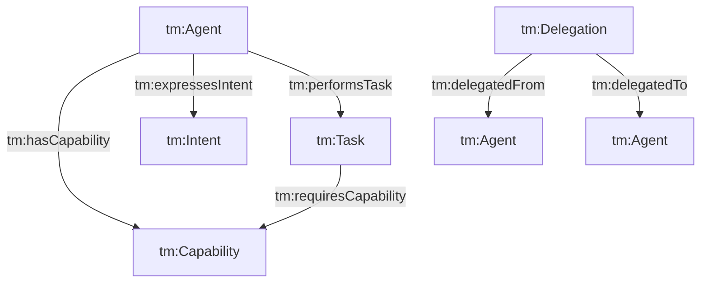

## Threat Model Ontology (`ontologies/threat-model.ttl`)

Defines a minimal vocabulary for **semantic interoperability and threat modeling** among agents: agent, capability, task, intent, delegation, and task-graph structure. Includes small axioms useful for detecting mismatches (e.g., capability misrepresentation).

### Key terms

- **Classes**
  - `tm:Agent`, `tm:Capability`, `tm:Task`, `tm:Intent`
  - `tm:TaskNode`, `tm:TaskDependency`
  - `tm:Delegation`
  - `tm:CriticalCapability`, `tm:RestrictedCapability`
- **Object properties**
  - `tm:hasCapability` (Agent → Capability)
  - `tm:requiresCapability` (Task → Capability)
  - `tm:expressesIntent` (Agent → Intent)
  - `tm:performsTask` (Agent → Task)
  - `tm:hasSubtask` (Task → Task)
  - `tm:hasDependency` (TaskNode → TaskNode)
  - `tm:delegatedTo` / `tm:delegatedFrom` (Delegation → Agent)
  - `tm:delegatesTask` (Agent → Task)
  - `tm:IntentAlignsWithTask` (Intent → Task)
- **Axioms (selected)**
  - `tm:CriticalCapability owl:disjointWith tm:RestrictedCapability`
 - **Recommended checks (selected)**
  - capability misrepresentation checks are expressed as **SPARQL/SHACL patterns** (see queries below) rather than ontology entailments

### Hierarchy diagram



### Relationship diagram



### SPARQL queries

```sparql
PREFIX tm: <https://w3id.org/agent-ontology/threat-model#>

# 1) Potential capability misrepresentation:
# tasks require capability that the performing agent does not claim
SELECT ?agent ?task ?requiredCap WHERE {
  ?agent tm:performsTask ?task .
  ?task tm:requiresCapability ?requiredCap .
  FILTER NOT EXISTS { ?agent tm:hasCapability ?requiredCap . }
}
```

```sparql
PREFIX tm: <https://w3id.org/agent-ontology/threat-model#>

# 2) Intent not aligned to any task (gap)
SELECT ?intent WHERE {
  ?intent a tm:Intent .
  FILTER NOT EXISTS { ?intent tm:IntentAlignsWithTask ?t . }
}
```

### Example (Agent Trust Graph domain)

```turtle
@prefix tm: <https://w3id.org/agent-ontology/threat-model#> .
@prefix gc: <https://global.church/ontology/gc#> .

gc:wycliffe-gca-eth a tm:Agent ;
  tm:hasCapability gc:scriptureTranslation ;
  tm:expressesIntent gc:intent-fund-shaikh-translation .

gc:task-translate-shaikh a tm:Task ;
  tm:requiresCapability gc:scriptureTranslation .

gc:intent-fund-shaikh-translation a tm:Intent ;
  tm:IntentAlignsWithTask gc:task-translate-shaikh .
```

